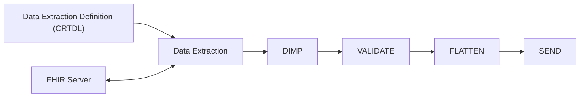
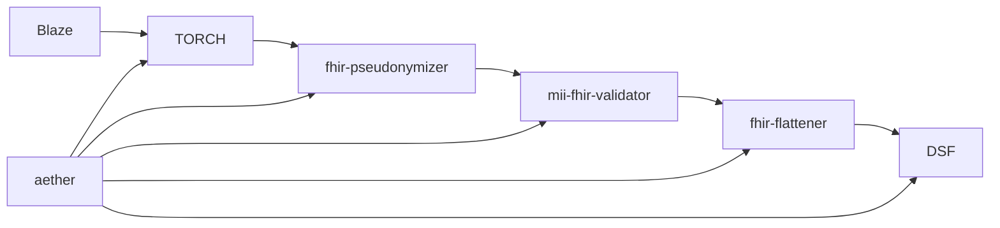

# Overview

[Aether](https://github.com/medizininformatik-initiative/aether) is a data use projct (DUP) pipeline coordination command line interface, which supports the whole process at a DUP site as follows:

To achieve this it interfaces with the following tools to create a reference DUP pipeline:

## Installing aether

To install aether follow the installation instruction [here](https://github.com/medizininformatik-initiative/aether?tab=readme-ov-file#installation)

## Using aether

Aether uses a .yml config file which allows you to configure which steps should be included in your DUP pipeline.

It creates a job directory, which for each DUP project saves the output of each step, so that one can branch of or review the output from each step