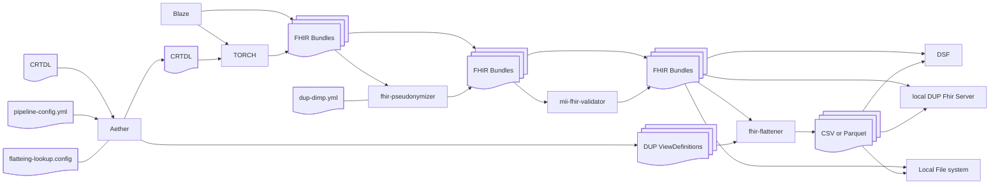

# Aether DUP pipeline coordinator

The DUP pipeline requires a Data Node to be set up with all the services required by the pipeline.

Please refer to the architecture of a data node [here](architecture.md) and a list of all the data node services [here](overview.md)

## Aether use

See aether documentation [here](https://medizininformatik-initiative.github.io/aether/)

## The DUP Reference Pipeline Detailed

Zooming in the more detailed pipeline can be depicted as follows:

