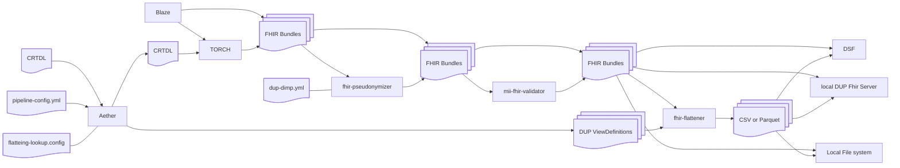

# aether DUP pipeline coordinator

The DUP pipeline requires a Data Node to be set up with all the services required by the pipeline.

Please refer to the architecture of a data node [here](architecture.md) and a list of all the data node services [here](overview.md)

## aether use

See aether documentation [here](https://medizininformatik-initiative.github.io/aether/).

For an example configuration see the base configuration in our example setup [here](https://github.com/medizininformatik-initiative/dataportal/blob/main/data-node/aether/base-pipeline-config.yml).

### aether simple example to get started

First install aether locally following the install instructions [here](https://medizininformatik-initiative.github.io/aether/getting-started/installation.html).

To get started using aether configure a simple pipeline as shown [here](https://github.com/medizininformatik-initiative/dataportal/blob/main/data-node/aether/base-pipeline-config-simple.yml).

and then run aether using `aether pipeline --config base-pipeline-config-simple.yml start queries/example-crtdl.json` in the [aether folder](https://github.com/medizininformatik-initiative/dataportal/tree/main/data-node/aether) of your data node.

Aether will run and then tell you the ID of your job e.g. `Job ID: 20260331_0915_5932b1e1-0ed5-4bab-902e-25f328209390`, which directly corresponds to a folder in your `jobs` directory. 

For this simple example you will find your extracted data in the `import` folder in the directory of your specific job.

Note that aether always creates all necessary folders for all supported steps:

1. import (TORCH export directory)
2. pseudonymized (Pseudonymized data)
3. validation (output information from the validation step - note this does not contain the data but validation results instead)
4. csv (flattened output if csv is chosen)
5. send (information about the send step)

## The DUP Reference Pipeline Detailed

Zooming in the more detailed pipeline can be depicted as follows:

```mermaid
flowchart LR
    n1["Blaze"] --> n2["TORCH"] & n3["FHIR Bundles"]
    n2 --> n3
    n3 --> n4["FHIR Bundles"] & n5["fhir-pseudonymizer"]
    n5 --> n4
    n4 --> n6["FHIR Bundles"] & n7["mii-fhir-validator"]
    n7 --> n6
    n6 --> n9["fhir-flattener"] & n11["DSF"] & n12["local DUP Fhir Server"] & n13["Local File system"]
    n9 --> n10["CSV or Parquet"]
    n10 --> n11 & n12 & n13
    n14["CRTDL"] --> n2
    n15["dup-dimp.yml"] --- n5
    n16["DUP ViewDefinitions"] --> n9
    n17["Aether"] --> n14 & n16
    n18["CRTDL"] --> n17
    n19["pipeline-config.yml"] --> n17
    n20["flatteing-lookup.config"] --- n17

    n3@{ shape: docs}
    n4@{ shape: docs}
    n6@{ shape: docs}
    n10@{ shape: docs}
    n14@{ shape: doc}
    n15@{ shape: doc}
    n16@{ shape: docs}
    n17@{ shape: rect}
    n18@{ shape: doc}
    n19@{ shape: doc}
    n20@{ shape: doc}
```