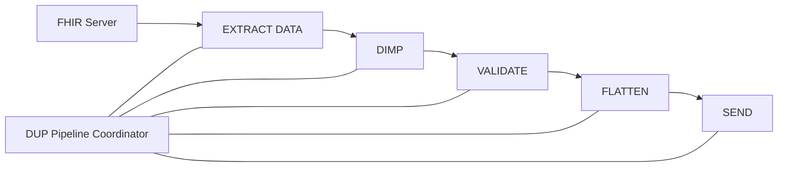
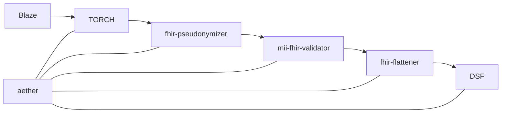
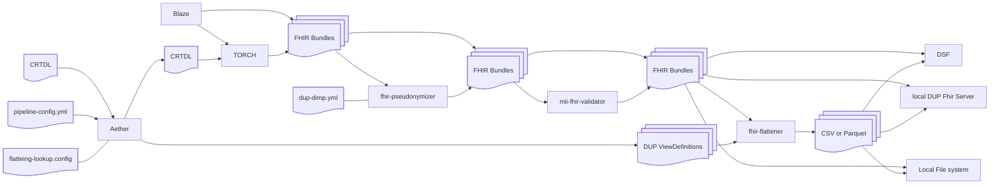

# The DUP Pipeline Overview

## Abstract DUP Pipeline

The DUP pipeline on an abstract level connects the following steps and services:

## Reference DUP Pipeline

Translated to the reference software provided the piepline looks as follows:

## The DUP Reference Pipeline Detailed

Zooming in the more detailed pipeline can be depicted as follows:

